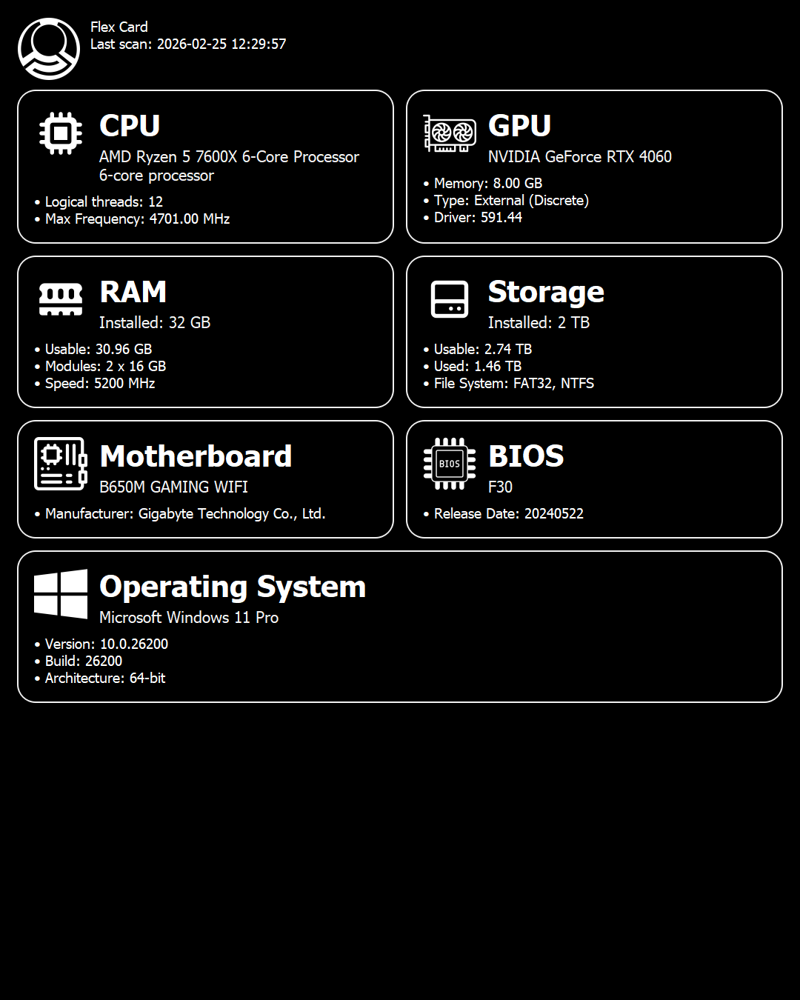

# Flex Card

**Flex Card** is a modern Windows desktop app built with **PyQt5** to scan and present hardware details in a clean, card-style UI.

It combines **WMI** + **psutil** data, supports one-click refresh, and can export a polished **PNG hardware summary card**.

---

## Screenshot



---

## What it shows

- **CPU**: name, physical cores, logical threads, current/max frequency
- **GPU**: detected adapters, memory, type (integrated/discrete), driver version
- **RAM**: installed/usable memory, module layout, speed
- **Storage**: installed capacity, usable/used space, file system summary
- **Motherboard**: manufacturer and model
- **BIOS**: BIOS version and release date
- **Operating System**: name, version, build, architecture

---

## UI and export highlights

- Dark-themed, card-based interface with section icons
- Last scan timestamp shown in-app
- **Refresh** button for live rescans
- **Export to .png** button to generate a shareable hardware summary image
- Automatic fallback handling for missing/unsupported fields (`N/A`)

---

## Tech stack

- Python 3
- PyQt5
- psutil
- WMI (with pywin32)
- Optional enhancement: `nvidia-smi` (if available) for better NVIDIA GPU memory/driver reporting

---

## Project structure

```text
Flex Card/
├─ app.py
├─ requirements.txt
├─ Flex Card.spec
├─ version_info.txt
├─ ss.png
└─ img/
```

---

## Run locally

```powershell
cd "D:\Garage\Flex Card"
pip install -r requirements.txt
python app.py
```

---

## Build Windows executable

### Option 1: Build using the spec file (recommended)

```powershell
cd "D:\Garage\Flex Card"
pyinstaller --noconfirm "Flex Card.spec"
```

### Option 2: Build directly from `app.py`

```powershell
cd "D:\Garage\Flex Card"
pyinstaller --noconfirm --onefile --windowed --name "Flex Card" --icon "img\Logo.png" app.py
```

Output executable:

- `dist/Flex Card.exe`

---

## Notes

- This application is **Windows-focused** because it depends on WMI classes.
- Hardware details can vary by BIOS, drivers, and OEM reporting quality.
- If Ubuntu font is unavailable, Qt will fall back to a system font automatically.
